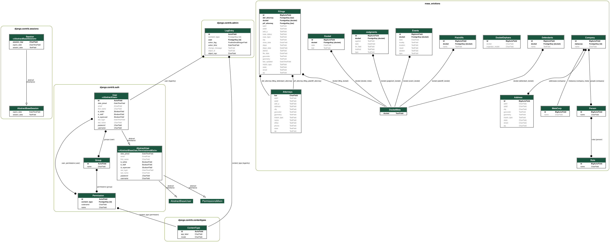

# Who Owns Massachusetts Backend

Django backend for Who Owns Massachusetts application. It is built to use a PostgreSQL/PostGIS instance. There are two Django apps---the first is `who_owns_mass`, which stores the results of our property [owner deduplication workflow](https://github.com/mit-spatial-action/who-owns-mass-frontend/). The second is `evictions`, which stores data related to summary process filings in Massachusetts. Work on interoperability between these two model sets is ongoing.

## DB Schema


## REST Endpoints

### `sites/{id}`

Returns `GeoJSON`-formatted details for a given property (which we call a site). JSON keys largely follow [our documenntation here](https://github.com/mit-spatial-action/who-owns-mass-processing/blob/main/DICTIONARY.md).

### `metacorps/{id}`

Returns details for a given metacorp (or network of companies). Includes the `sites` property, which is a `GeoJSON`-formatted list of properties owned by a given metacorp. JSON keys largely follow [our documenntation here](https://github.com/mit-spatial-action/who-owns-mass-processing/blob/main/DICTIONARY.md).

## Set Up the Application

### Setting Up Database PostgreSQL

The application is built to use a PostgreSQL instance with the PostGIS extension. To create this database, you can either use your preferred GUI (e.g., PGAdmin), or execute the following commands in e.g., `psql`.

```sql
CREATE DATABASE who_owns_mass;
\c who_owns_mass;
CREATE EXTENSION postgis;
```

### Create a Python Virtual Environment

Python offers multiple packages with which to manage virtual environments. `venv` will probably be just fine, but we have only tested this application in Python 3.10.2 and 3.13.0. If you run into Python version issues, use `pyenv-virtualenv`.

#### Simple Setup: `venv`

First, create your virtual environment. The line below creates the virtual environment in the root folder of the application.

```shell
cd 'path/to/application/who-owns-mass-backend'
python3 -m venv ./venv
```

##### Active the Environment

Activate the environment by running...

```shell
. ./venv/bin/activate
# or, more explicitly...
source ./venv/bin/activate
```

#### Version-Controlled Setup: `pyenv-virtualenv`

If you want a virtual environment running a particular Python version, configure an env using [pyenv-virtualenv](https://github.com/pyenv/pyenv-virtualenv). First, install the application.

Once it's installed, create the virtual Python environment like so...

```shell
pyenv virtualenv 3.10.2 venv
```

##### Activate the Environment

Activate the environment by running...

```shell
pyenv activate venv
```

You can trigger this environment automatically by running the following in the root folder of the application:

```shell
echo "venv" >> .python-version
```

#### Install Dependencies

Once you've activated the virtual environemnt, Use `pip` to install all Python dependencies.

```shell
pip install -r requirements.txt
```

### Configure Django

#### Run the application

You should now be able to run the application by executing the following line. By default, the application will be running at `localhost:8000`.

```shell
python ./manage.py runserver
```

#### Environment Variables and Settings

The application reads credentials and other environment variables from a `.env` file stored in `config/settings/`. For the app to run, the file should contain the following environment variables...

```bash
DB_NAME='your_database_name'
DB_USER='your_database_user'
DB_PW='your_database_password'
DB_HOST='database_hose'
# DB_Port should be given as a number.
DB_PORT=0000
# Probably 'require' for remote and 'allow' for localhost.
DB_SSL='require'
```

#### Local Settings

If you have a local development environment that uses a PostgreSQL instance running on `localhost`, you can create a `settings_local.py` file to store database credentials, etc. It is listed in `.gitignore` to ensure you don't accidentally commit your credentials. We provide a sample in `settings_local.example.py`. Create `settings_local.py` from this example by running...

```shell
cp config/settings/settings_local.example.py config/settings/settings_local.py
```

The file should contain the following:

```python
from .settings import *

DATABASES = {
    "default": {
        "ENGINE": "django.db.backends.postgresql",
        "NAME": "your_local_database",
        "USER": "your_local_user",
        "PASSWORD": "your_local_password",
        "HOST": "localhost",
        "PORT": 0000,
        "OPTIONS": {
            "sslmode": 'allow'
        },
    }
}
```

#### Migrate Database

Once you've successfully configured your databases, you need to migrate the database using provided migrations. Run the following command to start the migration process:

```shell
python ./manage.py migrate 
```

### You're Done!

The Django application is now ready to go! As a next step you should use see our documentation of the `write_to_django.R` process in the [who-owns-mass-processing repository](https://github.com/mit-spatial-action/who-owns-mass-processing/). This will write our deduplication results to the tables created by our Django models.

to run Django shell (and make it nice)
```
./manage.py shell_plus
```

## Visualizing Database Schema

```shell
pip install pygraphviz
python manage.py graph_models -a -g -o schema.png
```

